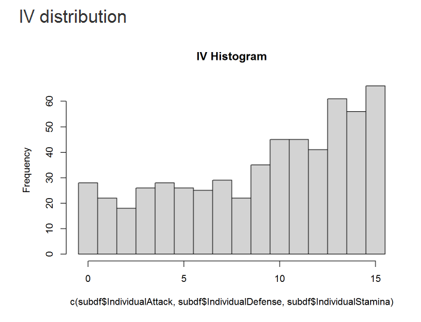

# pokemanageR
RMarkdown script to display IVs, compute max and evolved CP, compute cost to evolve, offense/defense rank (according to Professor Kukui) and much more.

**Requires a working MITM, use at your own risk (please refrain from asking questions how to set up MITM).**

Creates a dataframe with all information you need to be the very best.
Actively looking for feedback and contributors!

## Requirements

1. Windows (for out of the box results)
2. Working MITM (with SSL cert pinning disabled)
3. RStudio and knitr

## Setup

1. Download and install the latest version of R and RStudio
3. Download the `GAME_MASTER_POKEMON_v0_2.tsv` [here](https://gist.github.com/anonymous/540700108cf0f051e11f70273e9e2590) and copy it into the `/game_tables` folder
4. Download the protobuf 3 compiler [here](https://github.com/google/protobuf/releases/download/v3.0.0/protoc-3.0.0-win32.zip) (Windows!) and copy the 'protoc.exe' into your `/proto` folder
5. Download `inventory.proto` [here](https://www.reddit.com/r/pokemongodev/comments/4svl1o/guide_to_pokemon_go_server_responses/) and copy to `/proto`
5. Acquire a server inventory response, name it `response.bin` and copy to `/response`
6. Open RStudio and install `knitr` (uses `kable()` to display Markdown tables)
7. Open `pokemanageR.Rmd` in RStudio and knit by clicking on `Knit HTML` (or jump through the blocks with `Ctrl`+`Alt`+`C`)

Enjoy accurate IVs and some support in the decision which Pokemon to evolve!

## Fields

The final result is a dataframe conveniently called `df` (sorry for the bad naming convention). `df` contains a) a set of columns found in the inventory response as well as b) derived statistics.

a) Actual fields from the inventory:

* PokemonId
* Cp
* Stamina
* MaxStamina
* Move1
* Move2
* HeightM
* WeightKg
* IndividualAttack
* IndividualDefense
* IndividualStamina
* CpMultiplier
* CapturedS2CellId
* CreationTimeMs
* FromFort
* Nickname
* AdditionalCpMultiplier
* NumUpgrades

b) Derived statistics:

| Field | Explanation |
| --- | --- |
| PercentagePerfect | (IVA+IVD+IVS)/45 |
| CpEstimate | CP estimate according to CP formula (check) |
| CpMin | minimum CP == 0 IVs |
| CpMax | maximum CP == 15 IVs |
| CpPercentage | (CpMax - Cp) / (CpMax - CpMin) |
| Level | uses levels (1-40.5) not half levels (1-81) |
| Move1Name | |
| Move2Name | |
| Name | |
| MaxEvolutionId | PokemonId of the highest evolution for this species |
| RankOffense | Rank of moveset within Pokemon species according to Prof. Kukui |
| RankDefense | |
| GymOffense| |
| GymDefense| |
| PercentileOffense | |
| PercentileDefense | |
| TotalRankOffense | Offense Rank according to Professor Kukui |
| TotalRankDefense
| DustCost |  Cost to evolve to target level |
| CandyCost | |
| CpEvo | CP of evolved pokemon |
| Stardust | |
| CpTarget | CP of pokemon at target level |
| CpTargetMax | |
| CpTargetMin | |
| CpEvoTarget | CP of evolved pokemon at target level |

## Credit
This work relies on the fantastic work of many others. Please contact me if I haven't referenced you properly.

 * [Decoded GAME_MASTER by u/\_\_isitin\_\_](https://www.reddit.com/r/pokemongodev/comments/4t59t1/decoded_game_master_protobuf_file_v01_all_pokemon/)
 * [Best movesets analysis by u/Professor_Kukui](https://www.reddit.com/r/TheSilphRoad/comments/4vcobt/posthotfix_pokemon_go_full_moveset_rankings/d5x9pj7)
 * [The fantastic guide to server responses by u/\_\_isitin\_\_  u/CpMultiplier](https://www.reddit.com/r/pokemongodev/comments/4svl1o/guide_to_pokemon_go_server_responses/)
 * [Exact CP formula](https://www.reddit.com/r/TheSilphRoad/comments/4t7r4d/exact_pokemon_cp_formula/)

## Known Issues

1. Parses the text file obtained through excuting `protoc` in a shell, should be done via 'RProtoBuf' directly. If you are able to build proto3 against the R toolchain, please contact me. See alse [RProtoBuf github.](https://github.com/eddelbuettel/rprotobuf/issues/6)
2. Pokemon nicknames can contain 1 whitespace character max
3. General code style is not great
